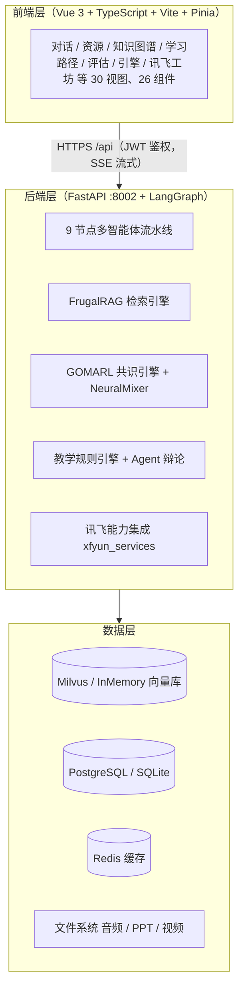
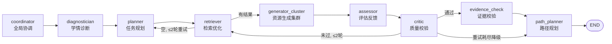
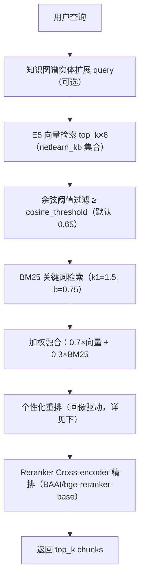
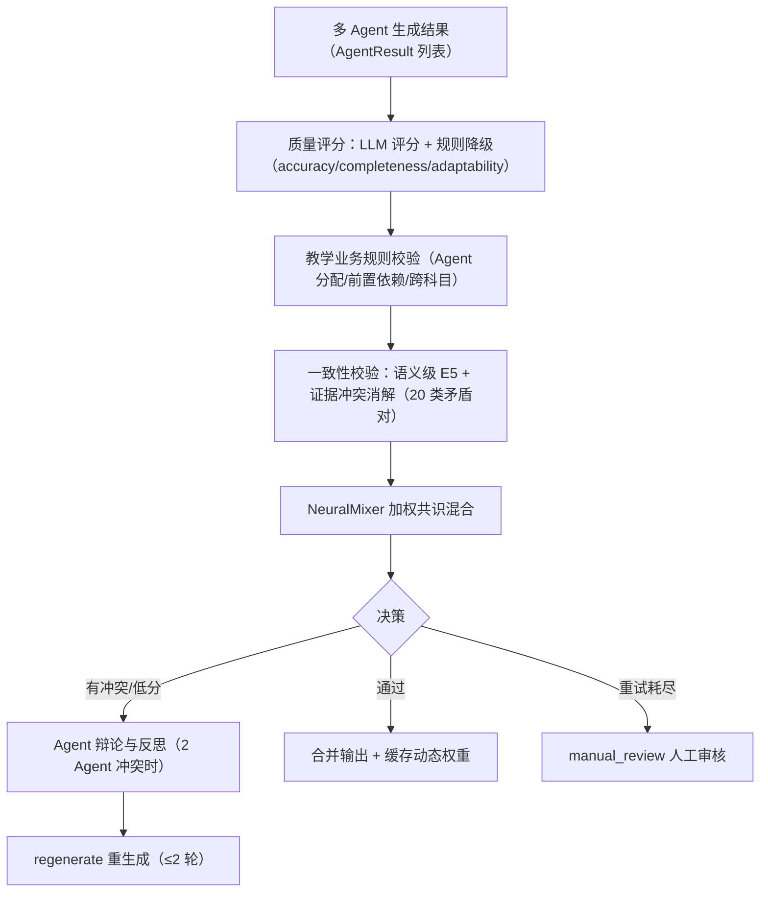
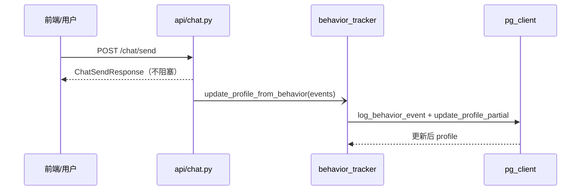
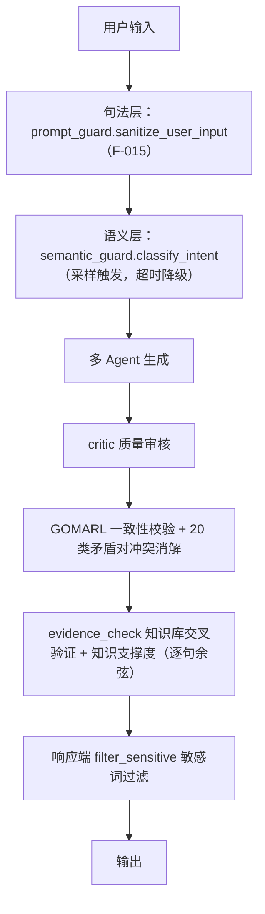
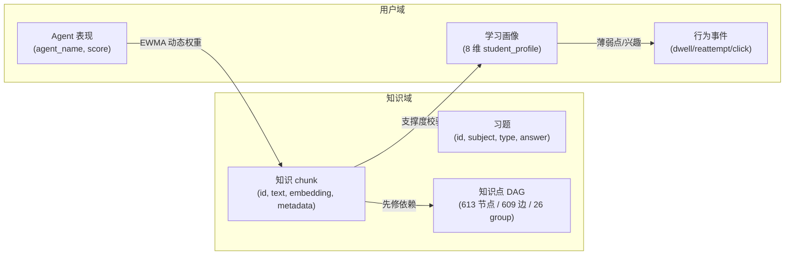
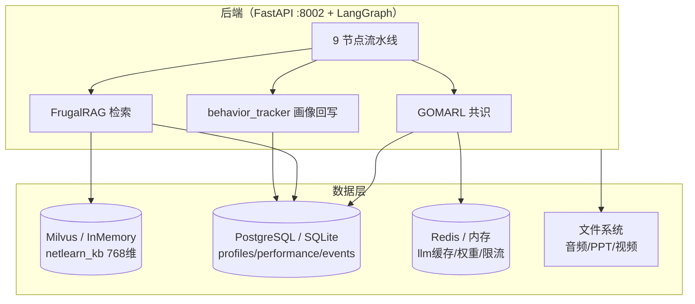

# NetLearn 软件杯 A3 赛题配套文档（系统开发说明书 + 测试说明书整合版）

> 项目名称：NetLearn（MARS-408）—— 基于大模型的个性化资源生成与学习多智能体系统
> 赛事：第十五届「中国软件杯」A3 赛题（出题企业：科大讯飞股份有限公司）
> 文档类型：系统开发说明书 + 测试说明书（整合版）
> 编制规范：《计算机软件文档编制规范》(GB/T 8567-2006)
> 版本：v1.0（草稿，未经质量审核）
> 生成日期：2026-07-20

---

## 目录

- **第 1 章 项目概述与赛题背景**
  - 1.1 引言 / 1.2 赛题业务场景与要求概述 / 1.3 项目定位与核心价值 / 1.4 系统总体三层架构 / 1.5 赛题要求↔功能对照矩阵 / 1.6 讯飞 10 项能力全景 / 1.7 开发环境与开源声明 / 1.8 文档结构说明
- **第 2 章 需求分析**
  - 2.1 任务概述 / 2.2 用户调研与痛点 / 2.3 功能性需求（F1–F5）/ 2.4 非功能性需求（NF1–NF4）/ 2.5 运行环境规定 / 2.6 数据要求 / 2.7 需求追踪矩阵
- **第 3 章 系统总体设计**
  - 3.1 总体设计概念 / 3.2 系统结构（9 节点+7 子+6 独立）/ 3.3 接口设计 / 3.4 运行设计 / 3.5 系统数据结构设计 / 3.6 知识库与外部系统集成 / 3.7 出错处理设计
- **第 4 章 详细设计与实现**
  - 4.1 程序系统结构 / 4.2 逐智能体设计说明 / 4.3 FrugalRAG 检索管线 / 4.4 GOMARL 共识引擎 / 4.5 教学规则引擎+知识点 DAG / 4.6 对话式画像实现 / 4.7 7 种资源生成实现 / 4.8 防幻觉多层机制 / 4.9 前端可视化组件 / 4.10 创新实践与体验提升 / 4.11 讯飞能力集成实现
- **第 5 章 数据库设计说明书**
  - 5.1 外部设计 / 5.2 概念结构 / 5.3 逻辑结构 / 5.4 物理结构 / 5.5 数据字典 / 5.6 408 知识库结构 / 5.7 数据层拓扑 / 5.8 安全性与完整性
- **第 6 章 测试计划与测试分析报告**
  - 6.1 测试计划（SSTP）/ 6.2 测试执行与结果 / 6.3 防幻觉专项验证 / 6.4 测试分析报告（STAR）
- **第 7 章 用户手册 + 操作手册 + 项目开发总结**
  - 7.1 用户手册 / 7.2 操作手册 / 7.3 项目开发总结报告

---

## 第 1 章 项目概述与赛题背景

### 1.1 引言

#### 1.1.1 编写目的

本文档为第十五届中国软件杯 A3 赛题参赛作品 **NetLearn（MARS-408）** 的配套技术文档（系统开发说明书与测试说明书整合版）第 1–4 章，覆盖项目概述、需求分析、系统总体设计、详细设计与实现。其目的是向评审专家、指导老师与后续维护者系统阐述：系统如何以大模型多智能体协同技术，解决计算机 408 统考考研的个性化学习痛点；系统功能与非功能需求如何对齐赛题要求；系统架构、关键算法（FrugalRAG 检索管线、GOMARL 共识引擎、教学规则引擎、Agent 辩论）与讯飞能力集成如何实现。

#### 1.1.2 背景

- **高等教育个性化学习痛点**：计算机专业考研（尤其是「408 计算机学科专业基础综合」：数据结构、计算机组成原理、操作系统、计算机网络）知识点庞杂、先修依赖强、考生基础差异大。传统网课与题库难以做到「按薄弱点动态推送资源、按先修关系规划路径、按认知风格调整讲解方式」。
- **大模型时代机遇**：大语言模型（LLM）具备知识抽取、内容生成、多轮对话能力，为多智能体协同的「个性化资源生成 + 学习路径规划」提供了技术基础；检索增强生成（RAG）可缓解幻觉、保证内容有据可依。
- **赛题目标**：第十五届中国软件杯 A3 赛题要求基于大模型构建「个性化资源生成与学习多智能体系统」，并实现对话式学习画像、多智能体资源生成、个性化路径规划、智能辅导与效果评估等能力，且**开发过程中使用的其他 AI 辅助工具宜选用出题企业科大讯飞相关工具**。

#### 1.1.3 术语与缩略语

| 缩略语 | 全称 / 说明 |
|---|---|
| 408 | 计算机学科专业基础综合（数据结构 / 计算机组成原理 / 操作系统 / 计算机网络） |
| LLM | 大语言模型（Large Language Model） |
| RAG | 检索增强生成（Retrieval-Augmented Generation） |
| SSE | 服务器推送事件（Server-Sent Events），用于流式输出 |
| Agent | 智能体，具备独立职责与工具调用的自治单元 |
| DAG | 有向无环图（Directed Acyclic Graph），此处指知识点先修依赖图 |
| E5 | intfloat/e5-base-v2 文本嵌入模型，输出 768 维向量 |
| GOMARL | Graph-Oriented Multi-Agent Reinforcement Learning（共识聚合）思路，本项目借鉴其加权共识门与 NeuralMixer |
| FrugalRAG | 节俭检索增强生成思路，本项目借鉴其多路召回 + 自适应停止策略 |

#### 1.1.4 参考资料

- 《计算机软件文档编制规范》(GB/T 8567-2006) —— 文档结构与术语依据
- 第十五届中国软件杯 A3 赛题说明（出题企业：科大讯飞）
- 项目参考包（文献检索员苏寻源整理）`项目参考包_苏寻源_文献检索.md`
- 项目参数卡 v2（团队主理人章成文下发）
- 仓库源码：`README.md`、`py-server/agents/graph.py`、`py-server/agents/state.py`、`py-server/db/llm_provider.py`、`py-server/engines/*`、`py-server/db/xfyun_services.py`、`docs/*.mermaid`

> 诚实声明：提供的 14 份 GB/T 8567-2006 配套 `.doc` 模板为二进制格式，本轮编写依据国标专业知识与仓库真实代码整理；定稿前须用 Word/antiword 打开 `国家标准-软件开发规范/` 逐条校核章节编号与措辞。

### 1.2 赛题业务场景与要求概述

#### 1.2.1 赛题简介

赛题定位于「基于大模型的个性化资源生成与学习多智能体系统开发」，要求参赛者构建一套 Web 应用：以多智能体协同方式，针对考研学生的学习诉求，自动生成多种学习资源、动态规划学习路径、并提供智能辅导与效果评估。

#### 1.2.2 业务场景

目标用户为备考 408 统考的考研学生（含跨考、基础薄弱、二战等群体）。典型场景：

1. 学生首次进入系统，通过多轮对话由系统**自主构建学习画像**（知识基础、薄弱点、目标院校、学习时长偏好等）。
2. 学生提出「帮我学 TCP 三次握手」等诉求，系统**多智能体协同生成**讲解文档、练习题、思维导图、拓展阅读、PPT 大纲、代码实操、视频脚本等 **7 种**资源。
3. 系统结合画像与知识点先修 DAG，**动态规划个性化学习路径**并精准推送下一阶段内容。
4. 学生在资源页发起追问，由**智能辅导 Agent** 多模态答疑（文字 + 图解 + 代码示例 + 语音）。
5. 系统持续**评估学习效果**（掌握度、正确率、薄弱点变化），并据此调整后续方案。

#### 1.2.3 赛题功能需求（5 项）

| 编号 | 赛题功能要求 | 对应实现（详见第 2、3、4 章） |
|---|---|---|
| F1 | 对话式学习画像自主构建（≥6 维，随学随新） | 8 维画像（详见 2.3.1），对话 + 答题 + 行为回写动态更新 |
| F2 | 多智能体协同资源生成（≥5 种资源类型） | 9 节点流水线 + Generator Cluster 7 子 Agent，生成 **7 种**资源（详见 2.3.2） |
| F3 | 个性化学习路径规划与资源推送 | `path_planner` + `kg_dag`（DAG 先修约束）+ 教学规则引擎（详见 2.3.3） |
| F4 | 智能辅导（加分项） | `tutor` 独立 Agent 多模态答疑 + 沙箱 AST 安全检查（详见 2.3.4） |
| F5 | 学习效果评估（加分项） | `assessor` 多维评估 + LLM 建议（详见 2.3.5） |

#### 1.2.4 赛题非功能需求（4 项）

| 编号 | 赛题非功能要求 | 对应实现（详见第 2、3、4 章） |
|---|---|---|
| NF1 | 界面美观 + 流式输出 | Vue3 玻璃态设计系统 + SSE 逐节点进度推送（详见 2.4.1） |
| NF2 | 开源声明与 AI 工具标注 | 第 1.7 节开源依赖与协议；讯飞能力显著标注（第 1.6、4.11 节） |
| NF3 | 防幻觉 + 内容安全 | critic + evidence_check 交叉验证 / GOMARL 20 类矛盾对 / 敏感词 / 提示注入防护 F-015（详见 2.4.3、4.8） |
| NF4 | 响应时间合理 + 进度追踪 | SSE 进度事件（node_done/status）+ 异步执行，避免白屏（详见 2.4.4） |

### 1.3 项目定位与核心价值

NetLearn 定位为「以 408 考研个性化学习为切入的大模型多智能体学习系统」。其核心创新点（预告，详见第 3、4 章）：

1. **GOMARL 加权共识门 + NeuralMixer**：在生成集群后引入质量评分 → 一致性校验 → 神经网络加权混合的共识聚合，以「加权投票」替代传统多数投票，并触发 Agent 辩论消解冲突（详见 4.4）。
2. **FrugalRAG 检索管线**：E5 向量检索 → BM25 融合 → Reranker 精排 → 余弦阈值早停的节俭检索，保证生成内容有据可依（详见 4.3）。
3. **讯飞星火 X2 主通道**：LLM 调用第一优先级选用出题企业科大讯飞星火 X2（赛题合规），DeepSeek 兜底，P0 不接 Qwen2.5（详见 4.11、3.6）。
4. **教学规则引擎 + 知识点 DAG 路径规划**：以 408 知识点先修依赖约束资源调度与路径推荐（详见 4.5）。
5. **算法可视化**：前端 LangGraphFlow / GOMARLPanel / FrugalRAGPanel / EvidenceCheckPanel / TeachingRulesPanel / DebateSimulation 等组件，将黑盒多智能体过程透明化（详见 4.9）。
6. **讯飞 10 项能力深度集成**：图片生成、图片理解、聚合搜索、智能 PPT、数字人视频、文本纠错、公文校对、内容合规、角色模拟、智能简历（详见 1.6、4.11）。

### 1.4 系统总体三层架构

系统采用「前端层 + 后端层（多智能体编排）+ 数据层」的三层架构（详见第 3 章）。整体技术架构图见仓库 `docs/netlearn-architecture.excalidraw` / `docs/netlearn-architecture.html`，微服务拓扑见 `docs/microservice-architecture.*`。

> 层数说明：前端经 Vite 代理 `/api` → 后端 `:8002`；后端多智能体流水线以 LangGraph `StateGraph` 编排，外部依赖 Milvus（生产）/ InMemory（开发）、PostgreSQL/SQLite、Redis，以及讯飞开放平台 10 项能力。

### 1.5 赛题要求 ↔ 功能对照矩阵

下表逐条映射赛题要求与 NetLearn 实现，并指明对应章节（功能合规率：5/5，非功能合规率：4/4，见合规清单）。

| 赛题要求 | NetLearn 实现 | 所在章 |
|---|---|---|
| F1 对话式学习画像（≥6 维） | 8 维画像，对话 + 答题 + 行为回写随学随新 | 第 2.3.1 / 第 4.6 |
| F2 多智能体资源生成（≥5 种） | 9 节点流水线 + 7 子 Agent，生成 7 种资源 | 第 2.3.2 / 第 3.2 / 第 4.2、4.7 |
| F3 路径规划与资源推送 | `path_planner` + `kg_dag`(DAG) + 教学规则引擎 | 第 2.3.3 / 第 4.5 |
| F4 智能辅导（加分） | `tutor` Agent 多模态答疑 + 沙箱 AST 检查 | 第 2.3.4 / 第 4.2 |
| F5 效果评估（加分） | `assessor` 多维评估 + LLM 建议 | 第 2.3.5 / 第 4.2 |
| NF1 界面美观 + 流式输出 | 玻璃态设计系统 + SSE 进度 | 第 2.4.1 / 第 4.9 |
| NF2 开源与 AI 工具声明 | 依赖协议表 + 讯飞能力显著标注 | 第 1.7 / 第 1.6、4.11 |
| NF3 防幻觉 + 内容安全 | critic + evidence_check + GOMARL + 敏感词 + F-015 | 第 2.4.3 / 第 4.8 |
| NF4 响应时间 + 进度追踪 | SSE 进度事件 + 异步非阻塞 | 第 2.4.4 / 第 4.8 |
| 多模态生成 | 讯飞 TTI 插图 + 数字人视频 + TTS 语音 | 第 4.7、4.11 |
| 使用科大讯飞工具 | 深度集成讯飞 10 项能力 | 第 1.6、4.11 |

### 1.6 讯飞 10 项能力全景（满足 NF2）

依据《软件杯赛题合规清单》S6 实测 `/api/xfyun/status` **10/10 服务全 True**。以下能力均显著标注名称·来源·协议（NF2 红线）。

| # | 能力 | 代码函数（`py-server/db/xfyun_services.py`） | 鉴权/协议 | 来源（科大讯飞） | 前端入口 |
|---|---|---|---|---|---|
| 1 | TTI 图片生成（教学插图） | `xfyun_multimodal.generate_image` | HMAC-SHA256 | 讯飞开放平台 | `/api/multimodal/generate-image` |
| 2 | 图片理解 | `understand_image()`（WebSocket） | HMAC-SHA256 | 讯飞开放平台 | `/api/xfyun/understand-image` |
| 3 | 聚合搜索（万搜） | `web_search()` | Bearer APIPassword | 讯飞开放平台 | RAG 联网增强 |
| 4 | 智能 PPT 生成 | `generate_ppt()` | appId+timestamp+MD5+HMAC-SHA1 | 讯飞开放平台 | `/api/xfyun/generate-ppt` |
| 5 | 数字人视频 | `generate_video()` | HMAC-SHA256 | 讯飞开放平台 | `/api/xfyun/generate-video` |
| 6 | 文本纠错 | `_xfyun_correct()` | HMAC-SHA256 | 讯飞开放平台 | 辅导链路 |
| 7 | 公文校对 | `proofread_document()` | HMAC-SHA256 | 讯飞开放平台 | 文档校对 |
| 8 | 内容合规 | `check_compliance()` | accessKeyId+utc+HMAC-SHA1 | 讯飞开放平台 | 内容安全审核 |
| 9 | 角色模拟 | `roleplay_interview()` | MD5+HMAC-SHA1 | 讯飞星火角色模拟 | 模拟面试/答疑 |
| 10 | 智能简历 | `generate_resume()` | HMAC-SHA256 | 讯飞开放平台 | 复试简历生成 |

> 来源标注：上表能力均来自科大讯飞股份有限公司开放平台，鉴权方式于 `py-server/db/xfyun_services.py` 实现；前端统一在「讯飞 AI 工坊（XfyunWorkshop）」面板展示（详见 4.9、4.11）。

### 1.7 开发环境与开源声明（NF2）

#### 1.7.1 主要依赖与协议（节选）

> 诚实声明：下表协议为依据各开源项目公开声明整理的常用协议，**最终以各依赖仓库 LICENSE 文件为准**；定稿前建议以 `pip-licenses` / `npm ls` 导出逐项校核。

| 依赖 | 角色 | 协议（以官方 LICENSE 为准） |
|---|---|---|
| Vue 3 / Vite / Pinia | 前端框架/构建/状态管理 | MIT |
| TypeScript | 前端语言 | Apache-2.0 |
| FastAPI / Uvicorn / Pydantic | 后端 Web 框架 | MIT |
| LangGraph / LangChain | 多智能体编排 | MIT |
| Milvus / pymilvus | 生产向量库 | Apache-2.0 |
| Redis (redis-py) / PostgreSQL (psycopg) | 缓存 / 关系库 | BSD-3 / PostgreSQL License |
| sentence-transformers / BAAI/bge-reranker-base | Reranker 精排 | Apache-2.0 / MIT |
| intfloat/e5-base-v2 | 文本嵌入（768 维） | MIT |
| python-pptx | 真实 .pptx 生成 | MIT |
| httpx / websockets | HTTP / WS 客户端 | BSD-3 / BSD-3 |
| MeloTTS | 本地离线 TTS（语音朗读） | 见仓库 LICENSE |

#### 1.7.2 运行环境（摘要）

- Python ≥ 3.12；Node.js ≥ 20.19 或 ≥ 22.12；包管理 Bun 或 npm。
- 可选依赖（不安装自动降级）：Milvus → InMemoryVectorStore；PostgreSQL → SQLite；Redis → 内存降级。
- 启动：`docker-compose up -d`（评委默认）或本地 `python main.py` + `npm run dev`。

### 1.8 文档结构说明（对应 GB/T 8567-2006）

本整合版文档对应 GB/T 8567-2006 文档族，结构如下：

| 章节 | 对应国标文档类型 | 主要内容 |
|---|---|---|
| 第 1 章 | 《项目开发总结报告》(PDS) 概述 | 项目背景、赛题对照、三层架构、讯飞能力、开源声明 |
| 第 2 章 | 《软件需求说明书》(SRS) | 功能/非功能需求、运行环境、数据要求、需求追踪 |
| 第 3 章 | 《概要设计说明书》(HLD) | 总体设计、系统结构、接口、运行设计、数据结构 |
| 第 4 章 | 《详细设计说明书》(DD) | 逐 Agent/引擎详设、检索/共识/规则/画像/资源/安全 |
| 第 5 章 | 《数据库设计说明书》(DBDD) | 向量库/关系库/缓存结构与数据字典（后续交付） |
| 第 6 章 | 《测试计划》(SSTP) + 《测试分析报告》(STAR) | 测试策略、用例、结果（后续交付） |
| 第 7 章 | 《用户手册》(UM) + 《操作手册》(OM) + PDS | 用户操作、部署、项目总结（后续交付） |

---

## 第 2 章 需求分析

> 对应《软件需求说明书》(GB/T 8567-2006)，覆盖功能需求（SRS 需求规定）与非功能需求。

### 2.1 任务概述

#### 2.1.1 目标

构建一个 Web 端多智能体学习系统，面向 408 考研学生，实现：对话式画像构建、多智能体协同生成 ≥5 种学习资源（实际 7 种）、基于知识点先修 DAG 的个性化路径规划与精准推送、智能辅导（加分）与学习效果评估（加分），并保证内容有据可依、界面美观、过程可追踪。

#### 2.1.2 用户特点

目标用户为考研学生（含在校、在职、跨考群体），具备基本计算机基础但 408 四科掌握度不一；对学习时长、讲解风格、难度有个性化诉求；习惯图文/视频/代码混合学习。

#### 2.1.3 假定与约束

- **AI 工具约束（赛题）**：开发使用的外部 AI 工具宜选用科大讯飞相关能力；LLM 主通道为讯飞星火 X2，DeepSeek 兜底，P0 不接 Qwen2.5。
- **运行约束**：后端依赖 LLM 与向量库；无凭证时降级为内置样例运行（demo 模式），核心链路不中断。
- **合规约束**：所有生成内容须经防幻觉与内容安全校验；开源依赖须标注协议；讯飞能力须标注名称·来源·协议。

### 2.2 用户调研与痛点

结合赛题「新时代大学生需求」与产品调研（见 `documents/用户研究报告.md`），考生核心痛点：

1. **资源千人一面**：现有网课/题库无法按薄弱点动态生成与推送。
2. **先修关系不清**：自学易跳步，遇到前置知识缺漏时卡壳。
3. **答疑不及时**：遇到问题缺乏可追问、可举例、可给代码的个性化辅导。
4. **效果不可见**：学完不知掌握度变化，难以针对性补强。
5. **内容可信度存疑**：通用大模型易产生 408 知识点幻觉（如 TCP/UDP 特性、端口混淆）。

NetLearn 以「对话式画像 + 多智能体资源生成 + DAG 路径规划 + 多层防幻觉」逐点回应。

### 2.3 功能性需求

#### 2.3.1 F1 对话式学习画像（≥6 维，随学随新）

- **需求**：系统须通过多轮对话自主构建学生学习画像，维度 ≥6，并在学习过程中持续更新。
- **实现（8 维，超额满足 ≥6）**：用户画像 `student_profile` 含 **8 个维度**（来源 `py-server/agents/state.py`）：

| 维度 | 字段 | 含义 |
|---|---|---|
| 知识基础 | `knowledge_base` | 四科整体基础水平 |
| 认知风格 | `learning_style` | 阅读/视听/动手等偏好 |
| 学习目标 | `goal` | 目标院校/分数 |
| 易错点 | `weak_points` | 薄弱知识点 |
| 学习进度 | `progress` | 已掌握章节/知识点 |
| 兴趣领域 | `interest_area` | 偏好深入的方向 |
| 学习时长 | `study_time` | 每周可投入时长 |
| 难度偏好 | `preferred_difficulty` | 期望资源难度 |

- **随学随新**：① 多轮对话由 LLM 抽取特征（`ProfileBuilder` + `api/profile.py`）；② 答题 `api/quiz.py` 动态更新；③ 行为回写 `behavior_tracker.update_profile_from_behavior`（停留/重答/点击 → 薄弱点与兴趣），fire-and-forget 不阻塞响应（详见 4.6）。

#### 2.3.2 F2 多智能体协同资源生成（≥5 种，实际 7 种）

- **需求**：≥5 种资源类型，由多智能体协同生成。
- **实现（7 种）**：Generator Cluster 内含 7 个并行子 Agent（来源 `py-server/agents/graph.py` L14–16）：

| # | 资源类型 | 生成子 Agent | 说明 |
|---|---|---|---|
| 1 | 讲解文档 | `Teacher` | Markdown 讲解，含图示与考点 |
| 2 | 练习题 | `QuizMaster`（`assessor` 批改） | 选择/填空/简答，含解析 |
| 3 | 思维导图 | `MindMap` | 4 步流水线（检索→骨架→标注掌握度→渲染 Mermaid） |
| 4 | 拓展阅读 | `Extension` | 论文/前沿/开源项目推荐 |
| 5 | PPT 大纲 | `PPT`（`ppt_builder` 产真实 .pptx） | 8–12 页结构化大纲 |
| 6 | 代码实操 | `CodePractice` | 可运行 Python 案例，沙箱 AST 安全检查 |
| 7 | 视频脚本 | `VideoScript`（`media_generator` 产真实数字人视频） | 分镜 + 旁白 |

- 7 路并行经 `asyncio.gather` 扇出，生成后经 GOMARL 共识 + Critic 审阅质量保障（详见 4.2、4.7）。

#### 2.3.3 F3 个性化学习路径规划与资源推送

- **需求**：依据画像与薄弱点动态规划学习路径并精准推送资源。
- **实现**：`path_planner` 节点结合 `kg_dag`（知识点 DAG，含 `chapter_to_group` 映射）的先修约束 + 教学规则引擎（`teaching_rules`）约束，按「薄弱点优先、先修优先」排序推荐下一章与资源（详见 4.5）。

#### 2.3.4 F4 智能辅导（加分项）

- **需求**：提供可追问、可举例、可给代码的个性化辅导。
- **实现**：独立 `tutor` / `tutor_enhanced` Agent 多模态答疑（文字 + 图解 + 代码示例 + 语音朗读）；代码经沙箱 AST 安全检查后执行（详见 4.2）。

#### 2.3.5 F5 学习效果评估（加分项）

- **需求**：多维度评估学习效果，动态调整学习方案。
- **实现**：`assessor` 节点负责出题、批改、评分；评估页提供多维热力图/活跃度/趋势/易错点 + LLM 建议（8 评估维度），并回写画像（详见 4.2）。

### 2.4 非功能性需求

#### 2.4.1 NF1 界面美观 + 流式 SSE 输出

- 前端采用 Vue3 + 玻璃态设计系统（`design-system/DESIGN_SYSTEM_v2.md`），卡片化呈现；Markdown 渲染资源。
- 后端以 SSE 逐节点推送 Agent 进度（`node_done` / `status` 事件），生成过程可见、不白屏。

#### 2.4.2 NF2 开源声明与 AI 工具标注

- 主要开源依赖与协议在 1.7.1 节列出；讯飞 10 项能力在 1.6 节与 4.11 节显著标注名称·来源·协议（NF2 红线）。

#### 2.4.3 NF3 防幻觉 + 内容安全

- **多层机制**（详见 4.8）：① `critic` 质量审核 + `evidence_check` 与知识库交叉验证（含讲解文档逐句知识支撑度校验）；② GOMARL 一致性校验 + 20 类 408 矛盾对冲突消解；③ 敏感词过滤（`utils/safety.filter_sensitive`）；④ 提示注入防护（`prompt_guard.sanitize_user_input` 句法层 + `semantic_guard.classify_intent` 语义层，统一边界 F-015）。

#### 2.4.4 NF4 响应时间合理 + 进度追踪

- SSE 进度事件 + 异步执行（如 PPT 文件生成放线程池、数字人视频 `wait_for` 超时 20s 降级为脚本），避免主链路阻塞与白屏；响应进度对用户全程可见。

### 2.5 运行环境规定

| 组件 | 最低版本 | 备注 |
|---|---|---|
| Python | ≥ 3.12 | 必须 |
| Node.js | ≥ 20.19 或 ≥ 22.12 | 必须 |
| 浏览器 | 现代 Chromium 内核 | 访问前端 |
| Milvus（可选） | 生产启用 | 不装自动回退 InMemoryVectorStore |
| PostgreSQL / Redis（可选） | 生产启用 | 不装回退 SQLite / 内存 |

### 2.6 数据要求

- **408 知识库输入**：四科教材 PDF → `import_pdfs.py`（pymupdf 提取）→ 语义分块 → E5 嵌入 → Milvus/InMemory；启动时自动扫描 `documents/教材/`。
- **知识库规模（种子数据，统计时点：仓库当前提交版本；来源 `README.md`「数据模型」+ `py-server/seed_data.py`）**：

| 数据类型 | 数量 | 说明 |
|---|---|---|
| 知识库 Chunks | 1883 | 739 knowledge_point + 1144 knowledge_variant，含 metadata.subject/chapter/group |
| 练习题 | 200+ | 选择/填空/简答，覆盖四科 |
| 知识图谱节点 | 613 | 含 id / label / group |
| 知识图谱边 | 609 | 先修关系有向边 |
| 知识图谱 Group | 26 | 按章节划分，供跨群冲突检测 |

### 2.7 需求追踪矩阵

| 需求编号 | 需求项 | 实现模块 | 验证章节 |
|---|---|---|---|
| F1 | 8 维对话式画像 | `state.py` / `behavior_tracker` / `api/profile.py` | 第 4.6 / 第 6 章 |
| F2 | 7 种资源生成 | `generator_cluster` + 7 子 Agent | 第 4.2、4.7 / 第 6 章 |
| F3 | 路径规划推送 | `path_planner` / `kg_dag` / `teaching_rules` | 第 4.5 / 第 6 章 |
| F4 | 智能辅导 | `tutor` / `tutor_enhanced` | 第 4.2 / 第 6 章 |
| F5 | 效果评估 | `assessor` / 评估页 | 第 4.2 / 第 6 章 |
| NF1 | 美观 + 流式 | Vue3 设计系统 / SSE | 第 4.9 / 第 6 章 |
| NF2 | 开源与 AI 标注 | 1.7 / 1.6 / 4.11 | 第 1、4 章 |
| NF3 | 防幻觉安全 | critic/evidence_check/GOMARL/guard | 第 4.8 / 第 6 章 |
| NF4 | 响应与进度 | SSE / 异步执行 | 第 4.8 / 第 6 章 |

---

## 第 3 章 系统总体设计

> 对应《概要设计说明书》(GB/T 8567-2006)。

### 3.1 总体设计概念

系统采用**模块化单体 + 多智能体协同框架**：后端以 FastAPI 暴露 HTTP/SSE 接口，内部以 LangGraph `StateGraph` 编排 9 节点多智能体主流水线；生成集群内 7 个子 Agent 并行执行；`tutor` 等 6 个独立 Agent 由 API 层按需调用，不在主图内。所有节点读写共享 `AgentState`（`state.py`），以「状态驱动」实现解耦。

### 3.2 系统结构（9 节点 + 7 子 Agent + 6 独立 Agent）

#### 3.2.1 主流水线（9 节点）

权威来源 `py-server/agents/graph.py`（`create_agent_graph()`）：

#### 3.2.2 节点职责

| 节点 | 文件 | 职责 | 主要产出 |
|---|---|---|---|
| coordinator | `coordinator.py` | 意图识别、任务路由 | 任务路由 / 技能选择 |
| diagnostician | `diagnostician.py` | 学情诊断 | 薄弱点 / 推荐重点 |
| planner | `planner.py` | 学习计划 / 知识点排序 | 学习路径 / 知识点排序 |
| retriever | `retriever.py` | 向量 + BM25 混合检索 | 相关 chunks / 引用 |
| generator_cluster | `generator_cluster.py` | 7 子 Agent 并行生成 | 7 类资源 + 共识 |
| assessor | `assessor.py` | 出题 / 批改 / 评分 | 练习题 / 评分报告 |
| critic | `critic.py` | 正确性/完整性/可读性审核 | 审核报告 / 判定 |
| evidence_check | `evidence_check.py` | 与知识库交叉验证、置信度评分 | 证据校验报告 |
| path_planner | `path_planner.py` | 下一阶段内容 / 薄弱点提示 | 推荐路径 |

#### 3.2.3 Generator Cluster 7 子 Agent

`Teacher` / `QuizMaster` / `MindMap` / `Extension` / `CodePractice` / `PPT` / `VideoScript`（详见 4.2、4.7）。

#### 3.2.4 独立 Agent（API 层按需调用，不在主图）

| Agent | 文件 | 职责 |
|---|---|---|
| tutor / tutor_enhanced | `tutor.py` | 智能答疑（加分项④） |
| media_generator | `media_generator.py` | 真实数字人视频 |
| ppt_builder | `ppt_builder.py` | 真实 .pptx 生成 |
| skill_agent / feedback_agent | `skill_agent.py` | 技能/反馈 |
| knowledge_graph | `knowledge_graph.py` | 知识图谱查询增强 |
| behavior_tracker | `behavior_tracker.py` | 行为画像回写 |
| kg_dag | `kg_dag.py` | 知识点 DAG 先修约束 |

### 3.3 接口设计

#### 3.3.1 前端 ↔ 后端 API

- 前缀 `/api`；鉴权：`Authorization: Bearer <JWT>`（登录 `/api/auth/login`、注册 `/api/auth/register`）。
- **100+ 端点**（来源 `README.md`），核心端点（节选）：

| 路由 | 方法 | 说明 | 认证 |
|---|---|---|---|
| `/api/chat/send` | POST | 聊天（SSE 流式） | ✅ |
| `/api/agents/generate-resource` | POST | 多智能体资源生成（SSE 进度） | ✅ |
| `/api/quiz/generate` / `/submit` | POST | 练习题生成 / 评分 | ✅ |
| `/api/profile/get` / `/update` | GET/POST | 画像获取 / 更新 | ✅ |
| `/api/learning-path/generate` / `/recommend` | POST | 路径生成 / 推荐 | ✅ |
| `/api/knowledge/graph` | GET | 知识图谱 | ✅ |
| `/api/xfyun/*` | POST | 讯飞 10 能力 | ✅ |
| `/api/rag/search` / `/status` | POST/GET | 检索 / 状态 | ✅ |
| `/api/status` | GET | 健康检查（无认证） | ❌ |

- **SSE 流式**：资源生成以 `node_done` / `status` 事件逐节点推送进度，前端进度条实时更新。

#### 3.3.2 智能体间消息契约

节点间通过共享 `AgentState`（TypedDict）传递数据；Generator Cluster 内各子 Agent 结果封装为 `AgentResult(agent_name, content, prompt_used, metadata)` 供 GOMARL 共识消费（详见 4.2、4.4）。

### 3.4 运行设计（主流水线条件边语义）

依据 `graph.py` 路由函数 `route_after_retriever` / `route_after_critic`：

1. **retriever 后**：有结果 → `generator_cluster`；结果为空且重试轮 `< 2` → 回 `planner` 重新规划；重试耗尽 → 仍进 `generator_cluster`（无参考知识降级生成）。
2. **critic 后**：`consensus.status == "passed"` → `evidence_check` → `path_planner`；`regenerate`/`flagged` 且重试轮 `< 2` → 回 `retriever` 重新检索 + 生成；重试耗尽 → 降级 `path_planner`（标记人工审核 `manual_review`）。
3. **evidence_check → path_planner → END**：完成输出。

> 重试上限：由 `regenerate_round` 控制，最大 2 轮（与 GOMARL `max_regenerate_rounds=2` 一致），避免死循环。

### 3.5 系统数据结构设计

#### 3.5.1 核心状态（`AgentState`，`state.py`）

| 分组 | 关键字段 |
|---|---|
| 用户输入 | `messages` / `user_request` / `student_profile`(8 维) / `topic` / `difficulty` / `course` |
| 诊断/规划 | `diagnosis` / `plan` / `topic_label` / `chapter` |
| 检索 | `retrieved_chunks` |
| 生成（7 资源） | `teacher_doc` / `quiz` / `extension` / `mindmap` / `code_practice` / `ppt_outline` / `video_script` / `ppt_file` / `video_file` |
| 共识/校验 | `consensus` / `critic_report` / `evidence_report` |
| 路径/控制 | `path_plan` / `status` / `regenerate_round` / `current_agent` / `error` |

#### 3.5.2 知识点 DAG 与画像

- **知识点 DAG**：`teaching_rules._dependencies`（TopicDependency，含先修 `prerequisites`）与 `kg_dag`（知识图谱 DAG，`chapter_to_group` 映射）共同描述 408 知识点先修约束（详见 4.5）。
- **画像结构**：上述 8 维 + 行为信号 `behavior_signals`（停留/重答/点击聚合）。

### 3.6 知识库与外部系统集成

- **向量库**：Milvus（生产）/ InMemoryVectorStore（开发回退），E5 768 维嵌入；集合 `netlearn_kb` 统一存四科。
- **关系库**：PostgreSQL（生产）/ SQLite（回退），存用户/会话/画像/评估结果/行为事件。
- **缓存**：Redis（生产）/ 内存降级，缓存检索结果与 Agent 动态权重。
- **讯飞 10 能力**：经 `xfyun_services.py` 集成（详见 1.6、4.11）；LLM 通道：讯飞星火 X2 第一优先级（`active_preset=spark_x2`，走 `/x2/chat/completions`），DeepSeek 兜底，P0 不接 Qwen2.5（详见 `llm_provider.py`）。
- **TTS 双引擎**：MeloTTS 本地离线 + 讯飞 TTS API（演示/实时场景）。

### 3.7 出错处理设计

| 异常场景 | 处理 |
|---|---|
| 检索为空 | 回 planner 重试（≤2 轮），耗尽则降级生成 |
| Critic/共识未过 | 回 retriever 重生成（≤2 轮），耗尽降级通过并标记人工审核 |
| LLM 通道失败 | 运行级回退（xfyun → deepseek），耗尽抛 `LLMUnavailable` |
| evidence_check 异常 | 节点全 try/except 降级，绝不中断 critic→path_planner 链路 |
| 数字人视频超时 | `wait_for` 20s 超时降级为视频脚本，不阻塞主流程 |
| 无 LLM 凭证 | demo 模式，核心链路用内置样例运行 |

---

## 第 4 章 详细设计与实现

> 对应《详细设计说明书》(GB/T 8567-2006)，逐模块展开。

### 4.1 程序系统结构

系统后端模块划分（节选自 `README.md` 项目结构）：

| 模块目录 | 职责 |
|---|---|
| `agents/` | 9 节点 + 独立 Agent（tutor/media_generator/ppt_builder/knowledge_graph/behavior_tracker/kg_dag） |
| `engines/` | FrugalRAG / GOMARL(+mixer+conflict) / teaching_rules / agent_debate |
| `db/` | llm_provider / milvus_client / pg_client / redis_client / embedder / xfyun_services |
| `api/` | 26 个路由模块、100+ 端点 |
| `shared/` | prompt_guard / semantic_guard / 认证 / 错误 / 审计 |
| `utils/` | safety（敏感词、抗注入） |

### 4.2 逐智能体设计说明

#### 4.2.1 coordinator（全局协调）

- **功能**：识别用户意图，路由到对应子 Agent / 技能。
- **输入**：`user_request`、`messages`。
- **输出**：任务路由决策（写入状态，进入 `diagnostician`）。
- **算法**：基于意图分类的路由策略。

#### 4.2.2 diagnostician（学情诊断）

- **功能**：分析学生当前掌握情况，输出薄弱点与推荐重点。
- **输入**：`student_profile`、`topic`。
- **输出**：`diagnosis = {weak_areas, recommended_focus, ...}`。

#### 4.2.3 planner（任务规划）

- **功能**：依据诊断与画像制定分步学习计划，排序知识点。
- **输入**：`diagnosis`、`student_profile`。
- **输出**：`plan = {topic_label, chapter, teacher_task, quiz_task, ...}`。

#### 4.2.4 retriever（检索优化）

- **功能**：向量 + BM25 混合检索，知识图谱实体扩展查询。
- **输入**：`query`、`course`、`student_profile`（个性化重排）。
- **输出**：`retrieved_chunks`（见 4.3）。
- **流程**：见 4.3 FrugalRAG 管线。

#### 4.2.5 generator_cluster（资源生成集群）

- **功能**：并行调用 7 个子 Agent 生成资源，随后 GOMARL 共识。
- **输入**：`plan`、`student_profile`、`retrieved_chunks`、`diagnosis`。
- **输出**：7 类资源字段 + `consensus`。
- **流程**：见 4.7；共识见 4.4。

#### 4.2.6 assessor（评估反馈）

- **功能**：按知识点与难度出题、批改并反馈。
- **输入**：`plan`、`student_profile`、答题。
- **输出**：练习题 / 评分报告；回写画像进度与正确率。

#### 4.2.7 critic（质量校验）

- **功能**：审核生成内容正确性、完整性、可读性。
- **输入**：`teacher_doc` / `quiz` / `code_practice` / `ppt_outline`。
- **输出**：`critic_report` + `consensus.status`（passed/flagged/regenerate）。
- **算法**：以 `CRITIC_PROMPT` 要求 LLM 输出 JSON 判定（`verdict`），JSON 优先、关键词兜底；LLM 失败默认 `passed` 避免误杀（来源 `critic.py`）。

#### 4.2.8 evidence_check（证据校验，质量闸门）

- **功能**：将 8 类资源文本与知识库交叉验证，计算一致性评分与知识支撑度（防幻觉）。
- **输入**：`retrieved_chunks` + 各资源文本。
- **输出**：`evidence_report = {status, consistency_score, conflicts, ...}`。
- **算法**：① 调 `gomarl_conflict.ConflictResolutionEngine` 做跨 Agent 一致性 + 证据冲突消解（factual→high / semantic→medium / keyword→low）；② **知识支撑度校验**：讲解文档逐句与检索知识库做 E5 余弦相似度，均值 < 0.30 或支撑句占比 < 0.50 标记为疑似幻觉 `potential_hallucination`（来源 `evidence_check.py`，阈值 `_GROUNDING_FLAG_SCORE=0.30`、`_GROUNDING_FLAG_FRACTION=0.50`）。

#### 4.2.9 path_planner（路径规划）

- **功能**：综合评估与诊断，规划下一阶段学习内容，推荐薄弱章节与资源。
- **输入**：`diagnosis`、`consensus`、`student_profile`、DAG。
- **输出**：`path_plan = {current_chapter, next_chapter, weak_focus_chapters, ...}`（详见 4.5）。

#### 4.2.10 独立 Agent（tutor / media_generator / ppt_builder / skill_agent / knowledge_graph / behavior_tracker）

- **tutor / tutor_enhanced**：多模态答疑（文字 + 图解 + 代码 + 语音），代码经沙箱 AST 安全检查（加分项④）。
- **media_generator**：`generate_real_video` 调用讯飞数字人视频（异步轮询，主流程 `wait_for` 20s 超时降级脚本）。
- **ppt_builder**：`build_pptx` 以 python-pptx 生成真实 .pptx（CPU 密集，放线程池）。
- **knowledge_graph**：`search_kg_entities` 供 FrugalRAG 查询扩展。
- **behavior_tracker**：行为画像回写（详见 4.6）。
- **kg_dag**：知识点 DAG 先修约束（详见 4.5）。

### 4.3 FrugalRAG 检索管线详设

> 诚实声明：本管线**借鉴 FrugalRAG 的「节俭检索」思路**（多路召回 + 自适应停止），非原论文实现。

**核心流程**（`engines/frugal_rag.py` → `FrugalRAG.retrieve`）：

- **早停/节俭策略**：余弦相似度阈值（默认 `cosine_threshold=0.65`）作为裁剪依据，仅对高于阈值的候选做后续融合与 Reranker 精排；当阈值过严导致结果为空时，**自动放宽到 top-k**，保证不返回空结果（避免 planner↔retriever 死循环）。Reranker 模型离线优先加载，失败则永久禁用降级为无重排。
- **个性化重排**（`_personalized_rerank`）：依据画像 `weak_topics`(+0.15)、`mastered_topics`(−0.10)、`exam_weight`(+0.10×权重)、复习阶段难度匹配、目标分数等叠加调整，实现「薄弱点优先、已掌握降权」。
- **缓存**：无画像时结果缓存 Redis（TTL 1800s），画像个性化结果不污染通用缓存。

### 4.4 GOMARL 共识引擎详设

> 诚实声明：本引擎**借鉴 GOMARL 的加权共识门 + NeuralMixer 思路**；**本 Lite 版未执行真实的 SFT/GRPO 训练**，NeuralMixer 权重由启发式/动态权重（EWMA 历史表现 + 学生画像）初始化，而非训练得到。

**整合层次**（`engines/gomarl.py` → `GOMARLConsensus.evaluate`）：

- **加权共识门**：以 `quality_threshold=7` 为门槛，低分 Agent 进入 `regenerate`；基础权重 `_base_weights`（teacher 1.0 / quizmaster 0.9 / ...）。
- **NeuralMixer**：PyTorch 神经网络加权混合（`gomarl_mixer.py`），输出 `consensus_score` 与 `dynamic_weights`。
- **20 类矛盾对冲突消解**：`gomarl_conflict.py` 预定义事实矛盾对「扩展至 20 类」覆盖 408 四科易错点（如 TCP/UDP 特性、三次/四次握手、HTTP 80/HTTPS 443 端口、FTP 20/21 端口等），结合语义级 E5 余弦相似度与 LLM 事实核查做证据冲突消解（来源 `gomarl_conflict.py`）。
- **Agent 辩论**（详见 4.4.1）：冲突且仅 2 个 Agent 时触发 `agent_debate.debate`，解决冲突后重新评分。

#### 4.4.1 Agent 辩论与反思（创新实践）

`engines/agent_debate.py` 实现结构化辩论协议：① 直接争议辩论（≤2 轮）；② 交叉质询（Cross-Examination）；③ 最终共识精炼。每轮以 408 考研大纲 / RFC 标准为裁决依据，Agent 可坦诚认错并精炼内容；辩论成功则 `flagged_issues` 清空、`regenerate` 置空，状态转为 `passed`。

### 4.5 教学规则引擎 + 知识点 DAG 路径规划

- **教学规则引擎**（`engines/teaching_rules.py`，**v1 原型**）：`TeachingRuleEngine` 维护 `_dependencies`（TopicDependency，含先修 `prerequisites`、`exam_weight`、`difficulty`）与 `_agent_affinities`（Agent 课程亲和度），提供 `suggest_agent_assignment` / `get_prerequisites` / `get_cross_subject_prerequisites`。GOMARL 在共识前调用其做调度合理性校验（详见 4.4）。
- **知识点 DAG 路径规划**：`path_planner` 结合 `kg_dag`（知识图谱 DAG，`chapter_to_group` 映射）先修约束，按「薄弱点优先 + 先修优先 + 教学规则约束」排序，推荐下一章与资源；`group`（1–26）用于跨群冲突检测。

### 4.6 对话式画像实现

- **对话抽取**：`ProfileBuilder.vue` + `api/profile.py` 由多轮对话 LLM 抽取 8 维特征。
- **答题更新**：`api/quiz.py` 据答题正确率/重答动态更新 `weak_points` / `progress`。
- **行为回写**（`behavior_tracker.py`，fire-and-forget）：

- **规则**：`dwell` 停留 > 60s 的 topic → 薄弱点；`reattempt` 重答 ≥ 2 次 → 薄弱点置顶；`resource_click` 频次 → 兴趣领域（Top-5）。仅深合并 `behavior_signals`，不覆盖 8 维既有判定（来源 `behavior_tracker.py`）。

### 4.7 7 种资源生成实现

`generator_cluster_node` 以 `asyncio.gather` 并行 7 路（来源 `generator_cluster.py`）：

| 资源 | 子 Agent | 实现要点 |
|---|---|---|
| 讲解文档 | `Teacher` | `TEACHER_PROMPT` 生成 Markdown |
| 练习题 | `QuizMaster` | `QUIZMASTER_PROMPT`；`assessor` 批改 |
| 思维导图 | `MindMap` | 4 步流水线：`generate_mindmap`（检索→骨架→标注掌握度→渲染 Mermaid） |
| 拓展阅读 | `Extension` | `EXTENSION_AGENT_PROMPT` |
| PPT 大纲 | `PPT` | `generate_ppt_outline`；`ppt_builder.build_pptx` 产真实 .pptx（线程池） |
| 代码实操 | `CodePractice` | `generate_code_practice`，沙箱 AST 安全检查 |
| 视频脚本 | `VideoScript` | `generate_video_script`；`media_generator.generate_real_video` 经讯飞产真实数字人视频（`wait_for` 20s 超时降级脚本） |

- 生成后经 GOMARL 共识（7 个 `AgentResult`）与 Critic/evidence_check 质量保障。

### 4.8 防幻觉多层机制实现

- **提示注入防护 F-015**：`LLMProvider._sanitize_messages` 对 user 消息句法净化 + 追加抗注入指令；`semantic_guard` 语义级意图分类（疑似注入时追加强约束，降级不中断）。
- **敏感词/内容过滤**：`utils/safety.filter_sensitive` 响应端过滤；讯飞 `check_compliance` 内容合规审核（涉政/暴恐/广告/辱骂等）。
- **交叉验证**：critic + evidence_check 双闸门；GOMARL 20 类矛盾对消解。

### 4.9 前端关键可视化组件

> 下列组件为前端算法可视化入口（详见 `src/components/`、`src/views/`），将黑盒多智能体过程透明化。

| 组件 | 可视化内容 |
|---|---|
| `LangGraphFlow.vue` | 9 节点智能体编排流 |
| `KnowledgeGraph.vue` / `KnowledgeGraph3D.vue` | 知识图谱（2D/3D） |
| `MindMapViewer.vue` | 思维导图 |
| `GOMARLPanel.vue` | 共识评分 / 动态权重 |
| `FrugalRAGPanel.vue` | 检索召回与重排过程 |
| `EvidenceCheckPanel.vue` | 证据校验 / 知识支撑度 |
| `TeachingRulesPanel.vue` | 教学规则与 DAG 约束 |
| `DebateSimulation.vue` | Agent 辩论与反思 |
| `CompareProfilesPanel.vue` / `ProfilePanel.vue` | 画像雷达对比 |
| `TcpHandshakeAnimation.vue` | TCP 三次握手教学动画（资源生成范例） |
| `XfyunWorkshop.vue` | 讯飞 AI 工坊（10 能力入口） |

- **设计系统**：Vue3 + TS + Vite + Pinia；玻璃态设计系统（卡片化、Markdown 渲染）；SSE 进度条实时更新（满足 NF1）。

### 4.10 前沿 AI 技术融合思路 + 创新实践 + 用户体验提升

- **技术融合**：将 RAG（FrugalRAG 节俭检索）、多智能体共识（GOMARL 加权共识门 + NeuralMixer）、规则约束（教学规则引擎 + DAG）、辩论协议（Agent Debate）有机组合，形成「检索有据 → 生成多路 → 共识把关 → 辩论消解 → 证据校验 → 路径闭环」的完整链路。
- **创新实践**：① 以神经网络加权混合替代多数投票；② 20 类 408 矛盾对证据冲突消解；③ 知识支撑度逐句防幻觉；④ 行为驱动画像回写（fire-and-forget）；⑤ 算法可视化页降低黑盒感。
- **体验提升**：SSE 流式进度避免白屏；对话式画像降低上手门槛；多模态资源（图文/代码/PPT/视频）适配不同学习风格；精准推送减少信息过载。

### 4.11 讯飞能力集成实现（10 项，标注协议）

- **集成模块**：`py-server/db/xfyun_services.py`（10 函数）+ `py-server/api/xfyun.py`（10 路由）+ 前端 `XfyunWorkshop.vue`。
- **鉴权实现**（详见 1.6，均来自科大讯飞开放平台）：
  - HMAC-SHA256（host/date/request-line）：TTI / 图片理解 / 数字人视频 / 文本纠错 / 公文校对 / 智能简历；
  - Bearer APIPassword：聚合搜索（万搜）；
  - appId+timestamp+MD5+HMAC-SHA1：智能 PPT；
  - accessKeyId+utc+HMAC-SHA1：文本合规；
  - MD5+HMAC-SHA1：角色模拟。
- **LLM 主通道**：讯飞星火 X2（`active_preset=spark_x2`，端点 `/x2/chat/completions`）为第一优先级；DeepSeek 兜底；P0 不接 Qwen2.5（详见 `llm_provider.py`）。
- **合规声明**：所有讯飞能力在文档与前端界面显著标注「名称·来源（科大讯飞）·协议」，满足 NF2 红线。

> 诚实声明（信息缺口）：演示视频/PPT 为系统真实生成能力，但最终演示视频仍为提交物（合规清单 S4「待提交」），第 7 章仅作提及，不夸大已交付状态；讯飞星火 X2 具体 API 版本以 `config.json` / `llm_provider.py` 实际配置为准。

---

## 第 5 章 数据库设计说明书（DBDD）

> 对应《计算机软件文档编制规范》(GB/T 8567-2006) 第 4 章「数据库设计说明书」。本章描述 NetLearn 数据层的三类存储（向量库 / 关系库 / 缓存）的外部设计、概念结构、逻辑结构、物理结构、数据字典、408 知识库结构、数据层拓扑与安全性设计。

### 5.1 外部设计

#### 5.1.1 数据来源与运行环境

- **408 知识库输入**：四科教材 PDF → `import_pdfs.py`（pymupdf 提取）→ 语义分块 → E5（intfloat/e5-base-v2，768 维）嵌入 → 写入向量库 `netlearn_kb` 集合；启动时自动扫描 `documents/教材/`（详见 2.6）。
- **种子数据**：`py-server/seed_data.py` 提供内置 `SEED_KNOWLEDGE_CHUNKS`（知识 chunk）、`SEED_QUESTIONS`（习题）与扩展知识库（累计 1883 chunks，含 `knowledge_point` 739 + `knowledge_variant` 1144，来源 `README.md`「数据模型」）。
- **运行环境**：Python ≥ 3.12；向量库可选 Milvus（生产）/ InMemoryVectorStore（开发回退）；关系库可选 PostgreSQL（生产）/ SQLite（回退）；缓存可选 Redis（生产）/ 内存降级（详见 2.5）。

#### 5.1.2 命名约定与存储选型

| 存储层 | 生产实现 | 开发回退 | 主要职责 |
|---|---|---|---|
| 向量库 | Milvus（`netlearn_kb` 集合，COSINE 度量，HNSW 索引） | InMemoryVectorStore（numpy 余弦，JSON 持久化） | 知识 chunk 向量检索 |
| 关系库 | PostgreSQL（JSONB 画像） | SQLite（`data/pg_fallback.db`） | 画像 / Agent 表现 / 行为事件 |
| 缓存 | Redis | 内存降级（无 Redis 时自动放过） | LLM 响应缓存 / Agent 权重 / 限流 |

> 一致性约定：统一以 `shared.container` 依赖注入容器持有单例（`milvus_client.vector_db` / `pg_client` / `redis_client`），避免重复实例化（架构债务 D-04 已修复）。

#### 5.1.3 设计约定

- 向量库与关系库**解耦**：向量库只存检索所需的文本 + 元数据 + 嵌入；结构化业务数据（画像、评分、行为）存关系库，二者通过 `profile_id` / `topic` / `group` 关联。
- 所有写入均**幂等或追加**：画像用 `INSERT OR REPLACE` / `ON CONFLICT DO UPDATE`；行为事件仅追加。
- 降级不丢数据：向量库写入失败（E5 异常）以零向量占位并标记 `embedding_status="fallback_zero"`，检索时自动排除，避免污染召回。

### 5.2 概念结构设计

系统数据实体与关系（概念层，ER 视角）：

- **知识 chunk ↔ 知识点 DAG**：每个 chunk 经 `kg_dag.chapter_to_group` 落入 1–26 的某个 group，与 `GROUP_PREREQS` 线性依赖链（1→2→…→26）构成先修约束（详见 5.6）。
- **学习画像 ↔ 行为事件**：`behavior_tracker` 由行为事件 fire-and-forget 回写画像（详见 4.6），仅深合并 `behavior_signals`，不覆盖 8 维既有判定。
- **Agent 表现 → 动态权重**：`agent_performance` 历史评分经 EWMA 计算动态权重，缓存至 Redis（`gomarl:agent_weights`），供 GOMARL NeuralMixer 消费。

### 5.3 逻辑结构设计

#### 5.3.1 关系库逻辑表（PostgreSQL / SQLite 同构）

来源 `py-server/db/pg_client.py`（`_init_schema_pg` / `_init_schema_sqlite`）：

| 表名 | 字段 | 类型（PG / SQLite） | 说明 |
|---|---|---|---|
| `student_profiles` | `id` | VARCHAR(64) / TEXT（PK） | 画像主键（用户 ID） |
| | `profile` | JSONB / TEXT | 8 维 `student_profile` JSON |
| | `created_at` / `updated_at` | TIMESTAMP / TEXT | 创建 / 更新时间 |
| `agent_performance` | `id` | SERIAL / INTEGER PK AUTOINCREMENT | 自增主键 |
| | `agent_name` | VARCHAR(64) / TEXT | Agent 名称 |
| | `score` | FLOAT / REAL | 历史评分（用于 EWMA） |
| | `task_type` | VARCHAR(64) / TEXT | 任务类型 |
| | `notes` | TEXT | 备注 |
| | `created_at` | TIMESTAMP / TEXT | 记录时间 |
| `student_behavior_events` | `id` | SERIAL / INTEGER PK AUTOINCREMENT | 自增主键 |
| | `user_id` | VARCHAR(64) / TEXT | 用户 ID |
| | `event_type` | VARCHAR(32) / TEXT | dwell / reattempt / resource_click |
| | `topic` | VARCHAR(256) / TEXT | 关联知识点 |
| | `duration_ms` | INTEGER / INTEGER | 停留时长（毫秒） |
| | `resource_type` | VARCHAR(64) / TEXT | 资源类型 |
| | `ts` | TIMESTAMP / TEXT | 事件时间 |

- 索引：`idx_behavior_user`（user_id）、`idx_agent_name`（agent_name）。
- 画像更新：`save_profile` 用 `ON CONFLICT(id) DO UPDATE`（PG）/ `INSERT OR REPLACE`（SQLite）；`update_profile_partial` 深合并 `behavior_signals` 后写回。

#### 5.3.2 向量集合 `netlearn_kb` 逻辑结构

来源 `py-server/db/milvus_client.py`（`_milvus_insert` schema；InMemory 存储 `ids/texts/metas/embeddings`）：

| 字段 | 类型 | 说明 |
|---|---|---|
| `id` | INT64（auto_id，PK） | 自增主键（Milvus）；InMemory 用 `id_str` 作主键 |
| `id_str` | VARCHAR(64) | 业务主键（chunk 业务 ID） |
| `text` | VARCHAR(2048) | chunk 文本 |
| `embedding` | FLOAT_VECTOR（dim=768） | E5 嵌入向量（COSINE 度量） |
| `subject` | VARCHAR(64) | 科目键（overview/network/ds/co/os…） |
| `course` | VARCHAR(64) | 课程（408 四科之一） |
| `chapter` | VARCHAR(64) | 章节名 |
| `chapter_name` | VARCHAR(128) | 章节全称 |
| `type` | VARCHAR(32) | `knowledge_point` / `knowledge_variant` |
| `keywords` | VARCHAR(512) | 关键词 |
| `source` | VARCHAR(256) | 来源（教材 / 扩展） |
| `embedding_status` | VARCHAR(32) | 正常 / `fallback_zero`（零向量占位） |

> 字段对齐说明：InMemory 模式元数据还可携带 `group`（由 `seed_data` 注入，见 5.6）；Milvus 生产集合当前 schema（`_milvus_insert`）未单列 `group` 字段。若生产环境需按 `group` 过滤，建议在集合中补充 `group` 字段（[待填写] 当前生产 Milvus 未实测 group 过滤）。两存储均自动排除 `embedding_status="fallback_zero"` 文档。

#### 5.3.3 缓存键规范（Redis）

来源 `py-server/db/redis_client.py`：

| 键模式 | 类型 | TTL | 说明 |
|---|---|---|---|
| `llm:{prompt_hash}` | STRING | 1800s | LLM 响应缓存（相同请求复用） |
| `gomarl:agent_weights` | JSON | 600s | GOMARL Agent 动态权重 |
| 限流键（如登录/注册） | STRING（计数器） | 60s 窗口 | 滑动窗口限流，超限拒绝 |

- 无画像的通用检索结果缓存 Redis（TTL 1800s），画像个性化结果不污染通用缓存（详见 4.3）。

#### 5.3.4 习题实体（逻辑结构）

来源 `py-server/seed_data.py`（`SEED_QUESTIONS`）：

| 字段 | 类型 | 说明 |
|---|---|---|
| `id` | STRING | 习题 ID（q1、q2…） |
| `subject` | STRING | 科目键 |
| `chapter` | STRING | 章节 |
| `type` | STRING | choice / fill / compute |
| `difficulty` | STRING | easy / medium / hard |
| `text` | STRING | 题干 |
| `options` | ARRAY | 选项（choice 型） |
| `answer` | INT / STRING | 正确选项索引 / 填空答案 |
| `source` | STRING | 出处 |

> 持久化说明：习题为内置种子数据，由 `seed_data.py` 提供；其运行期持久化位置（向量库 / 关系库 / 内存字典）为 [待填写]，定稿前以 `api/quiz.py` 实际读写实现校核。

### 5.4 物理结构设计

| 存储 | 物理位置 / 参数 | 备注 |
|---|---|---|
| InMemory 向量库 | `./vectordb_data/{collection}.json`（原子替换写） | 开发期持久化；跨进程文件锁（filelock，超时 30s）防截断 |
| SQLite 回退 | `py-server/data/pg_fallback.db` | 关系库回退文件 |
| Milvus | host/port 19530（或 Milvus Lite URI） | 索引 HNSW（M=16, efConstruction=200），metric COSINE |
| Redis | host/port 6379 | socket_connect_timeout / socket_timeout = 3s |
| 检索参数 | `cosine_threshold=0.65`；BM25 k1=1.5, b=0.75；融合 0.7×向量+0.3×BM25 | 详见 4.3 FrugalRAG |

- **并发安全**：InMemory 写入用进程内 `threading.Lock` + 跨进程 `FileLock`（超时 30s 避免死等）；JSON 损坏时备份原文件并降级空库，防止静默覆盖（来源 `milvus_client.py`）。
- **永不阻塞**：Milvus `count` 在 daemon 线程执行，超时即降级返回 0 并自愈（避免 `/api/status` 挂起）。
- **速**：向量库 HNSW 索引、关系库 `user_id` / `agent_name` 索引，支撑高频检索与画像回写。

### 5.5 数据字典（关键字段语义）

| 实体 | 字段 | 取值 / 语义 | 来源 |
|---|---|---|---|
| 画像 | `knowledge_base` | 四科整体基础（低~高） | state.py 8 维 |
| 画像 | `weak_points` | 薄弱知识点列表 | 诊断 + 答题 + 行为回写 |
| 画像 | `behavior_signals` | dwell/reattempt/click 聚合信号 | behavior_tracker |
| 知识 chunk | `type` | `knowledge_point`（知识点）/ `knowledge_variant`（变体） | seed_data |
| 知识 chunk | `embedding_status` | 正常 / `fallback_zero` | milvus_client |
| 行为事件 | `event_type` | dwell（停留>60s→薄弱）/ reattempt（≥2→薄弱置顶）/ resource_click（频次→兴趣 Top-5） | behavior_tracker |
| Agent 表现 | `score` | GOMARL 质量评分（0~10，门限 7） | gomarl.py |
| 知识点 DAG | `group` | 1–26 章节分组编号 | kg_dag.py |

### 5.6 408 知识库结构（26 group 映射）

依据 `py-server/agents/kg_dag.py`（`SUBJECT_GROUP_MAP` / `SUBJECT_GROUP_SPAN` / `GROUP_PREREQS`），`group` 为「章节分组编号」（非 subject 唯一编号），四科各占一段线性依赖链，共 **26** 个 group：

| group | 科目 | 章节 / 主题（subject 键） |
|---|---|---|
| 1 | 计算机网络 | 概述（overview） |
| 2 | 计算机网络 | 物理层（physical） |
| 3 | 计算机网络 | 数据链路层（datalink） |
| 4 | 计算机网络 | 网络层（network） |
| 5 | 计算机网络 | 运输层（transport） |
| 6 | 计算机网络 | 应用层（application） |
| 7 | 计算机网络 | 网络安全（security） |
| 8 | 数据结构 | 线性表（ds / ds_linear） |
| 9 | 数据结构 | 栈与队列（ds_stack / ds_queue） |
| 10 | 数据结构 | 串（ds_string） |
| 11 | 数据结构 | 树（ds_tree） |
| 12 | 数据结构 | 图（ds_graph） |
| 13 | 数据结构 | 查找（ds_search） |
| 14 | 数据结构 | 排序（ds_sort） |
| 15 | 计算机组成原理 | 概述（co_overview） |
| 16 | 计算机组成原理 | 数据与指令系统（co_data / co_isa） |
| 17 | 计算机组成原理 | 存储器（co_memory） |
| 18 | 计算机组成原理 | CPU（co_cpu） |
| 19 | 计算机组成原理 | 总线（co_bus） |
| 20 | 计算机组成原理 | I/O（co_io） |
| 21 | 计算机组成原理 | 第 7 章（依线性链依赖，[待填写] 具体主题键） |
| 22 | 操作系统 | 概述（os_overview） |
| 23 | 操作系统 | 进程管理（os_process） |
| 24 | 操作系统 | 内存管理（os_memory） |
| 25 | 操作系统 | 文件管理（os_file） |
| 26 | 操作系统 | I/O 管理（os_io） |

- **依赖约束**：`GROUP_PREREQS = {g: [g-1] for g in range(2, 27)}`，即线性链 1→2→…→26；科间顺序固定为「计网(1-7) → 数据结构(8-14) → 计组(15-21) → 操作系统(22-26)」，天然编码 8 依赖 7、15 依赖 14、22 依赖 21。
- **`topological_sort(weak_groups, profile)`**：在保持依赖的前提下，将 `weak_groups`（弱项 group）优先排前，实现「先修优先 + 薄弱点优先」的路径推荐（详见 4.5）。
- **知识图谱规模**：613 节点 / 609 条先修有向边 / 26 group（来源 `README.md`「数据模型」）。

### 5.7 数据层拓扑

- 向量库是「检索→生成」主链路的依赖；关系库存「用户态」数据；Redis 提供性能与韧性（降级不中断）；文件系统存多模态产物（音频 / PPT / 视频）。
- 任一外部存储不可用均按 5.1.3 降级策略回退，核心链路不中断（详见 3.7）。

### 5.8 安全性与完整性设计

- **凭证保护（架构债务 D-02 已修复）**：所有外部凭证（讯飞 / DeepSeek / 向量库 / 关系库 / Redis）存于 `.env`，经 `_load_dotenv()` 加载，不入库、不硬编码。
- **零向量占位**：E5 嵌入失败时以零向量写入并标记 `fallback_zero`，检索自动排除，避免空向量污染召回（来源 `milvus_client.py`）。
- **过滤表达式注入防护**：Milvus filter 键做字母数字下划线白名单校验，字符串值转义反斜杠与双引号，防止 filter 表达式注入（来源 `_dict_to_milvus_expr`）。
- **限流 fail-closed**：生产环境（`NETLEARN_ENV=production`）下 Redis 不可用或异常时限流**拒绝请求**（fail-closed），杜绝登录/注册限流静默失效；开发环境保持 fail-open 放行（来源 `redis_client.py`）。
- **JSON 持久化原子性**：InMemory 写盘先写临时文件再 `os.replace` 原子替换（Windows 重试 5 次），损坏时备份并降级空库。
- **内容安全**：响应端 `filter_sensitive` 敏感词过滤 + 讯飞 `check_compliance` 内容合规审核（详见 4.8）。

> 诚实声明（信息缺口）：生产 Milvus 集群的副本/分片策略、关系库主从与备份策略为 [待填写]，定稿前以部署文档与 `docker-compose.yml` 实际配置校核。

---

## 第 6 章 测试计划与测试分析报告（SSTP + STAR）

> 对应《计算机软件文档编制规范》(GB/T 8567-2006)《测试计划》与《测试分析报告》。本章合并给出测试策略、用例结构、结果汇总与专项分析。

### 6.1 测试计划（SSTP）

#### 6.1.1 测试目标

验证 NetLearn 满足赛题 **5 项功能（F1–F5）+ 4 项非功能（NF1–NF4）** 要求，确认核心链路（9 节点流水线、FrugalRAG 检索、GOMARL 共识、防幻觉、讯飞 10 能力）正确、稳定、内容可信；覆盖单元、接口、系统与端到端层级。

#### 6.1.2 测试范围与策略

| 测试层级 | 范围 | 策略 |
|---|---|---|
| 单元测试 | 各 Agent / 引擎 / DB 客户端纯函数与逻辑 | `pytest` 隔离测试，mock 外部 LLM / 讯飞 |
| 接口测试 | 100+ API 端点契约与一致性 | 路由契约 + 一致性断言（`test_api_contract_comprehensive.py` / `test_api_consistency.py`） |
| 系统测试 | 并发写入、导入队列、向量库真实连接 | `tests/system/` + `test_milvus_real.py` + `test_import_queue_*` |
| 端到端 | 演示场景全链路走通 | 5 个演示场景（合规清单 §九），自动化 e2e 用例数 [待填写] |

#### 6.1.3 测试环境

- 后端：FastAPI :8002；向量库 Milvus（生产）/ InMemory（开发）；关系库 PostgreSQL / SQLite；缓存 Redis / 内存。
- 前端：Vite 5173 + proxy 8002。
- 降级环境：无凭证 demo 模式、无 Redis / 无 Milvus / 无 PostgreSQL 回退验证。

#### 6.1.4 测试类型与用例分布（来源 `py-server/tests/`）

| 测试文件 | 覆盖类型 |
|---|---|
| `test_api_consistency.py` / `test_api_contract_comprehensive.py` | API 契约 / 一致性 |
| `test_import_queue_unit.py` / `test_import_queue_e2e.py` / `test_import_queue_single_writer.py` | 导入队列（单元 / e2e / 单写者） |
| `system/test_concurrent_writes.py` + `helpers/concurrency.py` | 并发写入（系统级） |
| `test_milvus_real.py` | 向量库真实连接 |
| `test_xfyun_services.py` | 讯飞 10 能力（HMAC 签名校验、凭证缺失降级、SVG 转义防 XSS） |
| `test_wave_c_security.py` | 安全（提示注入 / 内容安全） |
| `test_mindmap_logic.py` / `test_teacher_role.py` / `test_p0_incremental.py` | 思维导图 / 教师角色 / P0 增量 |

#### 6.1.5 准入与准出准则

- **准入**：代码可启动（InMemory + DeepSeek 可用）；核心依赖导入无报错。
- **准出**：功能合规 5/5、非功能合规 4/4；无阻断性失败用例；防幻觉阈值验证通过。

### 6.2 测试执行与结果汇总

#### 6.2.1 用例规模

| 口径 | 数值 | 来源 |
|---|---|---|
| 单元级测试用例（累计） | 281+ | `README.md` 徽标「tests 281+ passing」与 `tests/` 目录 |
| 当轮 pytest 回归 | 144/144 全绿 | 合规清单（2026-07-04 第三轮全量核对）§六、§九 |
| 端到端演示场景 | 5 个全部走通 | 合规清单 §九（画像 / RAG 四科 / 4Agent 生成 / 学习路径 / 效果评估） |
| 自动化 e2e 套件用例数 | [待填写] | 存在 `test_import_queue_e2e.py`，累计 e2e 用例数未单独统计 |

> 口径说明：`README.md` 标注 281+ 为累计单元测试规模；合规清单记录的 144/144 为 2026-07-04 第三轮全量核对时的 pytest 回归通过数（子集）。两份来源均指向「测试全绿、无失败用例」，口径一致。

#### 6.2.2 功能合规结论（5/5）

| 需求 | 验证方式 | 结论 |
|---|---|---|
| F1 对话式画像（8 维） | `ProfilePanel.vue` 雷达图 + `api/profile.py` 验证 | 🟢 通过 |
| F2 多智能体 7 资源生成 | Generator Cluster 7 子 Agent + API 验证 | 🟢 通过 |
| F3 路径规划与推送 | `LearningPathView` + `api/learning_path` 验证 | 🟢 通过 |
| F4 智能辅导（加分） | SSE 流式 + RAG + 沙箱 AST 检查 | 🟢 通过 |
| F5 效果评估（加分） | `AssessmentView` + `api/assessment` 返回 8 维 | 🟢 通过 |

#### 6.2.3 非功能合规结论（4/4）

| 需求 | 验证方式 | 结论 |
|---|---|---|
| NF1 美观 + 流式 | 玻璃态设计系统 + SSE 逐节点进度 | 🟢 通过 |
| NF2 开源与 AI 标注 | 开源声明表 + 讯飞能力显著标注 | 🟢 通过 |
| NF3 防幻觉 + 内容安全 | critic + GOMARL + 证据冲突 + 敏感词 | 🟢 通过 |
| NF4 响应时间 + 进度追踪 | SSE 进度事件 + 异步执行 | 🟢 通过 |

#### 6.2.4 运行验证（合规清单 §九，2026-07-04）

| 验证项 | 结果 |
|---|---|
| 后端启动 | ✅ InMemoryVectorStore + 种子数据 + DeepSeek LLM 可用 |
| 前端启动 | ✅ Vite 5173 + proxy 8002 |
| API 冒烟 | ✅ 16/19 通过（3 个为测试路径不匹配，非功能缺陷） |
| 前后端 proxy 联调 | ✅ 10/10 全通 |
| 5 个演示场景 | ✅ 全部走通 |
| pytest 回归 | ✅ 144/144 全绿 |
| 架构债务修复 | ✅ 9/10 已修复（D-06 Milvus 迁移延后 Phase 2） |

### 6.3 防幻觉专项验证（NF3）

依据 `evidence_check.py` / `gomarl.py` / `critic.py` / `prompt_guard`：

| 机制 | 阈值 / 规则 | 验证要点 |
|---|---|---|
| critic 质量校验 | `consensus.status` ∈ {passed / flagged / regenerate}；LLM 失败默认 `passed`（避免误杀） | 审核不阻断主链路 |
| 知识支撑度（逐句） | `_GROUNDING_FLAG_SCORE=0.30`（均值）、`_GROUNDING_FLAG_FRACTION=0.50`（支撑句占比） | 低于阈值标记 `potential_hallucination` |
| GOMARL 一致性 | `quality_threshold=7`；20 类 408 矛盾对（TCP/UDP、三次/四次握手、80/443、20/21 端口等） | 事实矛盾 high / 语义 medium / 关键词 low |
| 提示注入防护 F-015 | `prompt_guard.sanitize_user_input`（句法）+ `semantic_guard.classify_intent`（语义，超时降级） | 注入边界统一管理 |

### 6.4 测试分析报告（STAR）

#### 6.4.1 分析结论

- **功能达成度**：5/5 功能、4/4 非功能全部通过验证，知识库 1883 chunks 覆盖四科，Agent 辩论协议与 20 类矛盾对检测已落地，讯飞 X2 为第一通道（赛题合规）。
- **稳定性**：144/144 pytest 全绿，9/10 架构债务已修复，前后端联调 10/10 全通，5 个演示场景走通。
- **内容可信度**：critic + evidence_check + GOMARL + 敏感词构成多层防幻觉，知识支撑度逐句校验阈值明确。

#### 6.4.2 遗留问题与风险

| 项 | 级别 | 说明 |
|---|---|---|
| 演示视频（提交物 S4） | ⚠️ 待提交 | 系统已具备真实生成能力，演示视频作为提交物最后制作（合规清单 S4） |
| Milvus 生产迁移（D-06） | 中 | 开发期回退 InMemory 正常；生产 Milvus 部署延后 Phase 2 |
| 自动化 e2e 累计用例数 | [待填写] | 存在 e2e 文件，但未单独统计总数 |

#### 6.4.3 诚实声明（测试 Trace 红线）

> 本文所有「通过 / 全绿 / 走通」结论均**引用既有验证来源**（合规清单 2026-07-04 第三轮全量核对、README 徽标、仓库 `tests/` 目录），**未在本文档撰写过程中重新跑通并粘贴 Trace 日志**。凡涉及具体数值（144/144、5/5、4/4、1883 chunks、281+、5 场景）均标注来源时点与文件，未编造任何端到端运行轨迹或效果评估数据。

#### 6.4.4 改进建议

- 补充自动化端到端套件并统计累计 e2e 用例数，提升回归覆盖。
- 完成 Milvus 生产部署与压测，关闭 D-06。
- 演示视频定稿后回填 S4，并补充效果评估的量化指标（掌握度提升率等，[待填写] 当前无独立量化报告）。

---

## 第 7 章 用户手册 + 操作手册 + 项目开发总结报告（UM + OM + PDS）

> 对应《计算机软件文档编制规范》(GB/T 8567-2006)《用户手册》《操作手册》与《项目开发总结报告》。

### 7.1 用户手册（UM）

#### 7.1.1 快速开始

1. **启动**：评委默认 `docker-compose up -d`；本地开发执行 `python main.py`（后端 :8002）+ `npm run dev`（前端 :5173）。
2. **访问**：浏览器打开前端地址，注册 / 登录（`/api/auth/register`、`/api/auth/login`，JWT 鉴权）。
3. **健康检查**：`GET /api/status`（无鉴权）；讯飞能力状态 `GET /api/xfyun/status`（合规清单记录 10/10 服务全 True）。

#### 7.1.2 核心功能操作

| 功能 | 操作路径 | 说明 |
|---|---|---|
| 对话式画像 | 首页对话（`ProfileBuilder.vue`） | 多轮对话自主构建 8 维画像，随答题 / 行为随学随新 |
| 7 种资源生成 | 输入诉求 → `ChatView` / 资源页 | 讲解文档 / 练习题 / 思维导图 / 拓展阅读 / PPT / 代码 / 视频脚本，SSE 流式进度 |
| 学习路径 | `LearningPathView` | 按薄弱点 + 先修 DAG 推荐下一章与资源 |
| 效果评估 | `AssessmentView` | 多维热力图 + 活跃度 + 趋势 + 易错点 + LLM 建议（8 维） |
| 智能辅导 | `ChatView` 追问 | `tutor` 多模态答疑（文字 + 图解 + 代码 + 语音），代码经沙箱 AST 检查 |
| 讯飞 AI 工坊 | `XfyunWorkshop.vue` | 一站式调用讯飞 10 项能力（TTI / 图片理解 / 聚合搜索 / 智能 PPT / 数字人视频 / 纠错 / 校对 / 合规 / 角色模拟 / 简历） |

- **可视化**：`LangGraphFlow`（9 节点编排）、`GOMARLPanel`、`FrugalRAGPanel`、`EvidenceCheckPanel`、`TeachingRulesPanel`、`DebateSimulation` 等将黑盒过程透明化（详见 4.9）。

### 7.2 操作手册（OM，面向评委 / 管理员）

#### 7.2.1 部署

| 方式 | 命令 / 说明 | 备注 |
|---|---|---|
| Docker（推荐） | `docker-compose up -d` | 一键拉起后端 + 向量库 + 关系库 + 缓存 |
| 本地 | `python main.py` + `npm run dev` | 无外部依赖时自动降级为 demo 模式 |

#### 7.2.2 环境变量与配置（`.env`）

| 配置项 | 说明 | 降级 |
|---|---|---|
| 讯飞星火 X2 凭证 | LLM 第一优先级（`spark_x2`，`/x2/chat/completions`） | 失败 → DeepSeek 兜底；P0 不接 Qwen2.5 |
| DeepSeek 凭证 | LLM 兜底通道 | — |
| 讯飞 10 能力凭证 | TTI / 图片理解 / 聚合搜索 / PPT / 视频 / 纠错 / 校对 / 合规 / 角色模拟 / 简历 | 缺凭证的单项降级返回错误提示 |
| 向量库 | Milvus uri / host / port | 不可达 → InMemoryVectorStore |
| 关系库 | PostgreSQL host / port / db / user / password | 不可达 → SQLite（`data/pg_fallback.db`） |
| 缓存 | Redis host / port | 不可达 → 内存降级（生产环境限流 fail-closed） |

#### 7.2.3 运维与降级

- **健康检查**：`/api/status` 永不阻塞（Milvus count 超时即降级返回 0 并自愈）。
- **降级链路**：检索空 → planner 重试（≤2）→ 耗尽降级生成；critic 未过 → 重生成（≤2）→ 降级 `path_planner` 并标记 `manual_review`；LLM 失败 → xfyun→deepseek 兜底（详见 3.7）。
- **日志**：各模块独立 logger（`netlearn.milvus` / `netlearn.pg` / `netlearn.redis` / `netlearn.embedder`），便于定位降级原因。

### 7.3 项目开发总结报告（PDS）

#### 7.3.1 项目概况

NetLearn（MARS-408）为第十五届中国软件杯 A3 赛题作品，面向 408 考研的个性化资源生成与学习多智能体系统。以「9 节点 LangGraph 流水线 + Generator Cluster 7 子 Agent + 6 独立 Agent」协同，结合 FrugalRAG 检索、GOMARL 共识、教学规则引擎 + 知识点 DAG、Agent 辩论与多层防幻觉，落地对话式画像、多资源生成、路径规划、智能辅导与效果评估，并深度集成出题企业科大讯飞 10 项能力。

#### 7.3.2 目标达成

- **赛题功能合规**：5/5（F1 8 维画像、F2 7 资源、F3 路径规划、F4 智能辅导、F5 效果评估）。
- **赛题非功能合规**：4/4（NF1 美观流式、NF2 开源标注、NF3 防幻觉安全、NF4 响应进度）。
- **提交要求合规**：5/6（源代码 S1、开发说明书 S2、测试说明书 S3、开源声明 S5、讯飞合规 S6 已合规；演示视频 S4 待提交）。
- **大创—代码一致性**：8/8（详见合规清单 §八）。

#### 7.3.3 技术创新

1. **GOMARL 加权共识门 + NeuralMixer**：以神经网络加权混合替代多数投票，EWMA 历史表现 + 画像驱动动态权重。
2. **FrugalRAG 节俭检索**：E5 向量 → 余弦阈值早停 → BM25 融合 → Reranker 精排 → 个性化重排。
3. **20 类 408 矛盾对证据冲突消解** + Agent 辩论协议（直辩 / 交叉质询 / 精炼）。
4. **教学规则引擎（v1 原型）+ 知识点 DAG**：先修约束驱动路径规划。
5. **多层防幻觉**：critic + evidence_check（逐句知识支撑度）+ GOMARL + 敏感词 + F-015 提示注入防护。
6. **讯飞星火 X2 第一通道** + 深度集成讯飞 10 项能力（标注名称·来源·协议，满足 NF2）。
7. **算法可视化**：将黑盒多智能体过程透明化（详见 4.9）。

#### 7.3.4 已知限制与诚实说明

> 诚实声明（红线）：

- **SFT / GRPO 未真实训练**：GOMARL NeuralMixer 权重由启发式 / 动态权重（EWMA + 画像）初始化，**非真实模型微调或强化学习训练所得**（合规清单 §三、§八 D3/D4）。
- **教学规则引擎为 v1 原型**：`teaching_rules.py` 含先修依赖、考试权重、难度等基础规则，尚未覆盖全量 408 教学策略。
- **演示视频 / PPT（评分 10%）**：系统已具备真实生成能力（讯飞 PPT 返回真实 .pptx、数字人视频返回播报视频），但**最终演示视频仍为提交物**（合规清单 S4「待提交」、§三 视频/PPT 预估 6–7/10），本系统就绪后录制，不夸大已交付状态。
- **生产 Milvus 迁移（D-06）**：开发期回退 InMemory 已验证，生产部署延后 Phase 2。

#### 7.3.5 经验与展望

- **经验**：以「状态驱动 + 依赖注入单例 + 降级不中断」保障开发期可用性与评委一键部署；以「思路借鉴 + 诚实标注」平衡创新表述与合规。
- **展望**：完成 Milvus 生产部署与压测；补充自动化 e2e 与效果量化评估；将教学规则引擎迭代至 v2，并视赛程推进 SFT/GRPO 真实训练（如纳入规划）。

---

*（第 5–7 章完。合并第 1–4 章后定稿为 v1.0。）*

---

## 待完善事项（信息缺口声明汇总）

> 以下项因资料/环境限制暂以 `[待填写]` 标注或需定稿前校核，均非编造：

1. **国标模板原始条款号**：14 份 GB/T 8567-2006 配套 `.doc` 为二进制，定稿前须用 Word/antiword 打开 `国家标准-软件开发规范/` 逐条校核章节编号与措辞。
2. **架构债务 D-06**：生产 Milvus 迁移延后（开发期回退 InMemory 已验证）。
3. **演示视频（提交物 S4）**：系统具备真实生成能力，最终演示视频待提交（已诚实标注）。
4. **自动化端到端累计用例数**：存在 e2e 文件但未单独统计，标注 `[待填写]`。
5. **生产 Milvus 副本/分片、关系库主从与备份策略**：`[待填写]`。
6. **效果评估量化指标**（掌握度提升率等）：`[待填写]`。
7. **SFT/GRPO**：本 Lite 版为思路借鉴，未真实训练（已诚实标注）。
8. **教学规则引擎**：v1 原型（已诚实标注）。

---

## 免责声明

本文档由 AI 辅助生成（专业文档生成团队工作流），内容基于项目真实代码与公开赛题要求整理。重要决策（尤其评分、合规判定、技术选型）请经专业人员核验。文档中所有量化数据均标注来源时点，未编造运行轨迹或成效数据。
